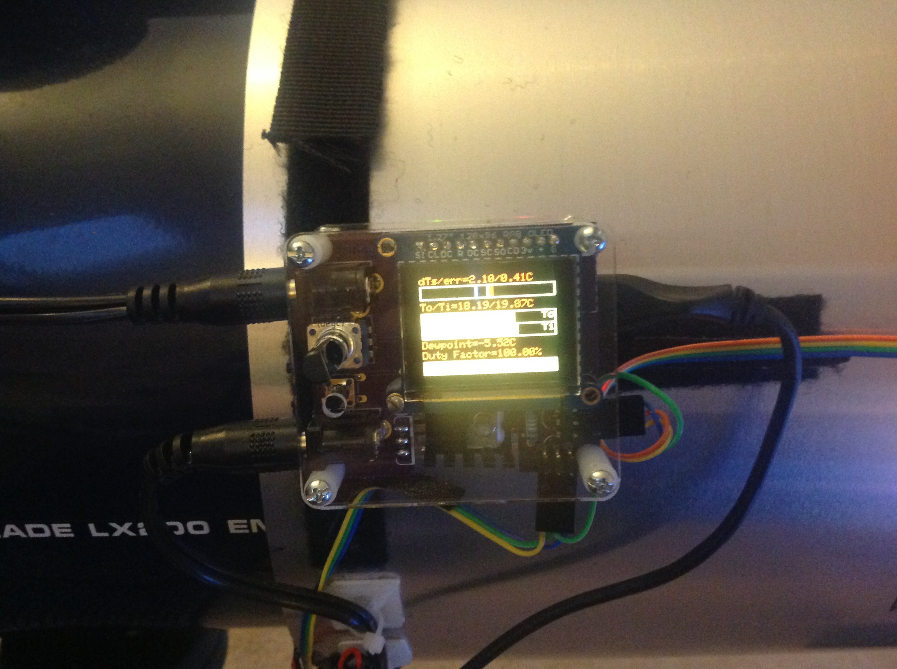

# Controller Module

The controller module is mounted on the dew shield. It monitors the
temperatures inside and outside the dew shield, and the relative
humidity.

## Copyright

The schematic and board designs are copyright 2016 C.Y. Tan and
released under the CERN Open Hardware License v1.2

